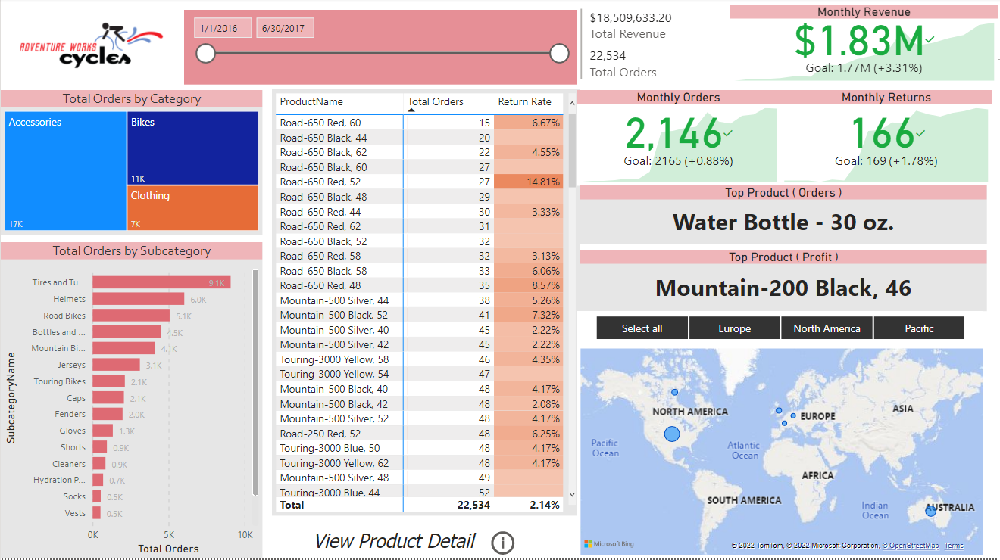
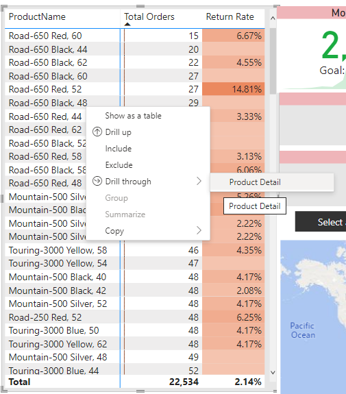

# Adventure Works Cycles
An interactive [dashboard](AdventureWorksReport.pbix) using Power BI

## Project Overview
The goal o this project is to design and deliver an ened-to-end business intelligence solution. The client needs a way to 
- Track core business KPIs: sales, revenues, profit, returns.
- Compare regional performance across sales territories.
- Analyze performance and trendings at the product level.
- Forecast future profit.
- Identify high-value customers.

### Sources
- Data Source : [Adventure Works CSV Files](AdventureWorksCSVFiles.7z)
- Work Environment : [Power BI Desktop x64](https://www.microsoft.com/en-us/download/details.aspx?id=58494)

## Core Objectives
Use Power BI Desktop to:
- Connect and transform the raw data.
- Build a relational data model.
- Create new calculated columns and DAX measures.
- Design an interactive report to analyze and visualize the data.

### Final Deliverable of the Project

 

We have executive summary here that allows you to break down the data and explore information by Categories and Subcategories. We also have core business KPIs, the Rvenue, Order volume and Returns for the current month. We have a quick snapshot of the most ordered product and the top revenue driving products and also included the ability to filter down the entire page by specific Sales Region. 
We included drill-through functionality to dive deeper into specific product performance and provided insights like Pacing against Targets, Profit Trendig Over Time and forecast into the future. 
 
 

 

 
 
The last part is a view all about the customers; Top Revenue driving customers, break down them by Gender, Income level and Occupation. We have orders by age, top customers and top line metrics related to customers, bookmarks and links to tire all pages toghether. 
  

